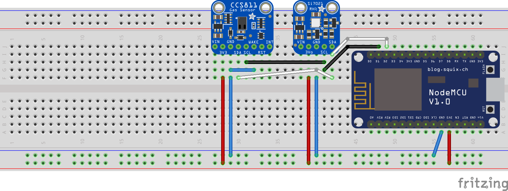
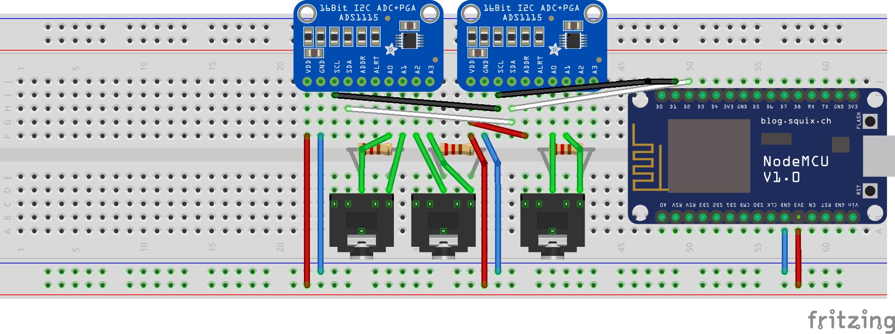

*Super Nanny Monitory System* is a ESP6288 NodeMCU based monitoring system that measures power consumption and air quality. The MCU collects the data and sends it to the InfluxDB via UDP. 

This is the hardware/firmware repository which contains wiring images, mapping lists and other documentations.

**The Main Programm is [Writing_Database.ino](https://github.com/joelvonrotz/energy-monitor/blob/master/source/Writing_Database/Writing_Database.ino)**

## Measurements Types

The device is split into two devices: power measurement and air quality, so that means double the microcontroller is required instead of a single one.

The two devices can measure power consumption and the air quality as mentioned before. Air quality measurements contains:

- CO2
- TVOC
- Temperature
- Humidity

The power measurement contains the measured power consumption only.

## Setup Arduino

### Arduino IDE

Obviously to use the program in your own version you'd need the Arduino IDE. Simply download it from the Arduino website.
This code has been written with the Arduino language and maybe in the future other options could be available (STM, Atmel, NXP, etc.).

[Link to Arduino IDE](https://www.arduino.cc/en/Main/Software)

### Visual Studio Code Arduino Extension

Faster programmer can use the Arduino extension by Microsoft for Visual Studio Code. Before installing it, be sure to have the Arduino IDE installed, as the extension requires the IDE. It takes some workload off and adds some small nifty features to it.

[Link to extension](https://marketplace.visualstudio.com/items?itemName=vsciot-vscode.vscode-arduino)

### Board support

As the project uses NodeMCU, you will need to set up the IDE to support it. This method works with both Visual Studio Code or if you are using the IDE directly.
- Open the Arduino IDE (This is used for VSCode also)
- Open the preferences pane
- Under `Aditional Boards Manager URLs` paste: `http://arduino.esp8266.com/stable/package_esp8266com_index.json`
- Close the preferences
- Close and reopen the IDE
- Go to `Tools -> Board ... -> Board Manager`
- Search ESP8266
- Find `esp8266 by ESP8266 Community` and install
- Go to `Tools -> Board` and select NodeMCU 1.0 (if that matches the NodeMCU that you are using)
- If using VSCode, press `ctrl+shift+P` or `cmd+shift+P` and type/select `Arduino: Board Config`
- Select NodeMCU 1.0 (if that matches the NodeMCU that you are using)

### Libraries

To correctly use this program, some libraries need to be installed first. Below should all the needed libraries be listed.

- [InfluxDB-UDP Library](https://github.com/joelvonrotz/Arduino_InfluxDB_UDP) by joelvonrotz
- [Si7021 Library](https://github.com/sparkfun/Si7021_Breakout) by SparkFun
- [CCS811 Library](https://github.com/adafruit/Adafruit_CCS811) by Adafruit
- [ADS1X15 Library](https://github.com/adafruit/Adafruit_ADS1X15) by Adafruit
- [ESP8266 Hardware Package](https://github.com/esp8266/Arduino) by ESP8266.<span></span>com

## Mapping List

The mapping list is used to determine which controller goes into which building and room. First concept was to use a JSON-file in a GitHub repository, but since GitHub is HTTPS secured and using the HTTPS-protocol with the ESP8266 would take a lot of time to learn (time which wasn't available due to our 3-week stay in Shanghai). The problem with HTTPS is the temporary certificates, that lose useability due to their duration. That certificate would need to be refreshed every time the old one is done.

The solution was a hard-coded table, sadly. The MAC address of each ESP is used to get the different information in the table. The advantage of this system is, is that everything is kept offline instead stored in a cloud, which makes offline use kind of useable.

Below is the current mapping since 17th of October 2018.

|MAC Address        |Location     |Room                |Type               |
|:------------------|:------------|:-------------------|:------------------|
| B8:77:10:C2:DD:BC | Building 9  | Fuse box           | Power Measurement |
| E8:42:69:3A:7D:80 | Coderbunker | artoffice          | Power Measurement |
| FB:61:69:3A:7D:80 | Building 9  | Classroom          | Air Quality       |
| 49:7A:10:C2:DD:BC | Building 9  | Meeting Room Green | Air Quality       |
| CD:36:69:3A:7D:80 | Coderbunker | Art Office         | Air Quality       |
| 3D:78:10:C2:DD:BC | Coderbunker | Kitchen            | Air Quality       |

Future people that are going to work on this, please keep this updated if new devices has been integrated into the system.

In the Arduino File called *Writing_Database.ino* is the mapping list and this is how it looks like:

```cpp
const String config[DEVICE_COUNT][TABLE_WIDTH]
{
    //MAC Address          location          room            type
    {"b8:77:10:c2:dd:bc", "building9",      "fusebox",      "power"     },
    {"44:39:69:3a:7d:80", "building1",      "dummy",        "power"     },
    {"e8:42:69:3a:7d:80", "coderbunker",    "artoffice",    "power"     },
    {"cd:36:69:3a:7d:80", "coderbunker",    "kitchen",      "quality"   },
    {"3d:78:10:c2:dd:bc", "coderbunker",    "artoffice",    "quality"   },
    {"fb:61:69:3a:7d:80", "coderbunker",    "classroom",    "quality"   },
    {"49:7a:10:c2:dd:bc", "coderbunker",    "meetingroom",  "quality"   },
    {"49:7a:10:c2:dd:bc", "coderbunker",    "meetingroom",  "quality"   }
};
```

### Add new MCU

To add new devices, it's actually very simple. First upload the program called *Get_MAC.ino* inside the *Get_MAC* folder and then the MAC-Address of the MCU should pop up in the Serial Monitor. Remember it!

Let's say the MAC-Address is ```13:57:91:AB:CD:EF```. Go back to the *Writing_Database.ino* program and increment the definition ```DEVICE_COUNT``` by one, for example from ```7``` to ```8```, so the compiler knows how big the new mapping list is.

If that has been made, let's add the device into the mapping list. Create a new empty package divided into 4 more sections, enough for the MAC-address, location, room and board type.

```cpp
const String config[DEVICE_COUNT][TABLE_WIDTH]
{
    //MAC Address          location          room            type
    {"b8:77:10:c2:dd:bc", "building9",      "fusebox",      "power"     },
    {"44:39:69:3a:7d:80", "building1",      "dummy",        "power"     },
    {"e8:42:69:3a:7d:80", "coderbunker",    "artoffice",    "power"     },
    {"cd:36:69:3a:7d:80", "coderbunker",    "kitchen",      "quality"   },
    {"3d:78:10:c2:dd:bc", "coderbunker",    "artoffice",    "quality"   },
    {"fb:61:69:3a:7d:80", "coderbunker",    "classroom",    "quality"   },
    {"49:7a:10:c2:dd:bc", "coderbunker",    "meetingroom",  "quality"   },
    {                   ,              ,                 ,              }
};
```

Don't forget the comma when adding a new package.

Next step is to fill in the sections. The *first* section is the *MAC-address* with the letters in ***lowercase***. The *second* section is the *location*, as an example let's take ```house``` and for the *third* section, the *room* name, let's take ```livingroom```. The *fourth* section is the *board type* and describes if the board is a power measurement board or an air quality measurement board. In this example it's going to be a power measurement board, so in the fourth section it will say ```power```.

```cpp
const String config[DEVICE_COUNT][TABLE_WIDTH]
{
    //MAC Address          location          room            type
    {"b8:77:10:c2:dd:bc", "building9",      "fusebox",      "power"     },
    {"44:39:69:3a:7d:80", "building1",      "dummy",        "power"     },
    {"e8:42:69:3a:7d:80", "coderbunker",    "artoffice",    "power"     },
    {"cd:36:69:3a:7d:80", "coderbunker",    "kitchen",      "quality"   },
    {"3d:78:10:c2:dd:bc", "coderbunker",    "artoffice",    "quality"   },
    {"fb:61:69:3a:7d:80", "coderbunker",    "classroom",    "quality"   },
    {"49:7a:10:c2:dd:bc", "coderbunker",    "meetingroom",  "quality"   },
    {"13:57:91:ab:cd:ef", "house",          "livingroom" ,  "power"     }
};
```

That's it, the new board is in and when uploading the new program on the MCU, it should configure itself correctly.

### Disadvantage of current solution

The problem with the mapping list is that it's a bad implementation of mapping, but as long as HTTPS is not correctly implemented in the program (updating certificate automatically either doesn't exist or I didn't look good enough in the documentation), it has to be implemented that way.

Additionally the biggest problem is the newer MCU will have a newer firmware with an updated mapping list.

## Sending Data

The current program sends UDP-Packages to a Raspberry Pi, that converts that UDP package to TCP packages and sends them over a HTTPS-connection.

This implementation has only been made to have access to a secure connection to the InfluxDB and it was a lot easier to implement it that way, instead of making our hands dirty to implement SSL on an ESP8266.

## Hardware

### Schematic

#### Air Quality Prototype



[PDF of the air quality schematic](assets/pdfs/Air_Quality_board_Schaltplan.pdf)

#### Power Measurement Prototype



The power measurement doesn't require 2 ADC, this built is for three phase measurements. If only one phase wants to be measured, simply remove the two audio jacks and resistors. The audio jack is a Stereo-jack, that means it has 3 pins: 1 sleeve, 1 ring and 1 tip.

[PDF of the power schematic](assets/pdfs/Power_meassurement_board_Schaltplan.pdf)

### Bill of material

#### Main Components

- ESP8266 NodeMCU v1.0
- USB-Micro cable for programming
- Breadboard or PCB
- Jumper Wires

#### Additional Hardware for Air Quality

- CCS811
- Si7021

#### Additional Hardware for Power Measurement

- ADS1115
- YHDC SCT-013-000 CT Sensor
- 3.5mm Headphone jack to PCB (Stereo or 3 pins)
- Burden Resistor

## Power consumption


### Measurement with test circuit


**L1 ratio** adjustable

**L2 ratio** 1 : 2000

**P1** UNI-T UT61A

**P2** KAISE MY-60

**OSC** RIGOL DS1054

**L1** DELIXI TDGC2-3KVA

**L2** YHDC SCT013-000-100A-50

---

To check if the circuit actually works, we had to built it up with the stuff that we found at XinCheJian. Fortunately, we found an adjustable transformer and some multimeters. Below should be some measurements we did with two different burden resistors and different currents.

| IP1   | Rm   | N     | IP2   | IP2\_cal | U1PP  | U1PP\_cal | U1PP\_cal  | IP2/IP2\_cal | U1PP/U1PP\_cal |
|:-----:|:----:|:-----:|:-----:|:--------:|:-----:|:---------:|:----------:|:------------:|:--------------:|
|       |      |       |       |          |       |           |based on IP2|              |                |
| [A]   | [Ω]  | [Wdg.]| [mA]  | [mA]     | [VPP] | [VPP]     | [VPP]      | [A/A]        | [V/V]          |
| 3.045 | 2160 | 1     | 1.130 | 1.523    | 6.680 | 9.300     | 6.900      | 0.740        | 0.720          |
| 2.503 | 2160 | 1     | 0.920 | 1.252    | 5.440 | 7.650     | 5.620      | 0.740        | 0.710          |
| 2.030 | 2160 | 1     | 0.740 | 1.015    | 4.480 | 6.200     | 4.520      | 0.730        | 0.720          |
| 1.503 | 2160 | 1     | 0.560 | 0.752    | 3.370 | 4.590     | 3.420      | 0.750        | 0.730          |
| 1.003 | 2160 | 1     | 0.350 | 0.502    | 2.160 | 3.060     | 2.140      | 0.700        | 0.710          |
| 0.526 | 2160 | 1     | 0.170 | 0.263    | 1.110 | 1.610     | 1.040      | 0.650        | 0.690          |
| 3.166 | 226  | 1     | 1.620 | 1.583    | 1.190 | 1.010     | 1.040      | 1.020        | 1.180          |
| 2.520 | 226  | 1     | 1.280 | 1.260    | 0.872 | 0.810     | 0.820      | 1.020        | 1.080          |
| 2.075 | 226  | 1     | 1.070 | 1.038    | 0.712 | 0.660     | 0.680      | 1.030        | 1.080          |
| 1.580 | 226  | 1     | 0.810 | 0.790    | 0.552 | 0.500     | 0.520      | 1.030        | 1.100          |
| 1.007 | 226  | 1     | 0.510 | 0.504    | 0.352 | 0.320     | 0.330      | 1.010        | 1.100          |
| 0.759 | 226  | 1     | 0.380 | 0.380    | 0.266 | 0.240     | 0.240      | 1.000        | 1.110          |
| 0.539 | 226  | 1     | 0.270 | 0.270    | 0.198 | 0.170     | 0.170      | 1.000        | 1.160          |

The ratio between the currents and voltages are pretty consistent and that's a good sign. The ration only changes when the burden resistor is changed.

### Measurement of three phase cable

Every single wire needs to be measured separately, because of the 120° offset to each other. Measuring all wires together would lead to a total current, which isn't an Addition of all single currents together (It is, but there are negative currents, which the circuit can't measure). Below is a table consisting of measurements of each wire.

| Cable ColorThickness | Current IP1 | Voltage U1 (Arduino) | Voltage (UP1\_calc) calculated with current IP1 | Measurement-resistor Rm | Voltage Arduino(U1: UP1\_calc) |
|:--------------------:|:-----------:|:--------------------:|:-----------------------------------------------:|:-----------------------:|:------------------------------:|
|                      | [A]         | [V]                  | [V]                                             | [Ω]                     | [V/V]                          |
| Red thick            | 3.920       | 0.493                | 0.443                                           | 226                     | 1.113                          |
| Blue thick           | 4.750       | 0.577                | 0.537                                           | 226                     | 1.074                          |
| Blue thick           | 5.280       | 0.640                | 0.597                                           | 226                     | 1.073                          |
| Green thick          | 2.720       | 0.326                | 0.307                                           | 226                     | 1.060                          |
| Red thick            | 1.570       | 0.188                | 0.177                                           | 226                     | 1.060                          |
| Green thick          | 2.850       | 0.333                | 0.322                                           | 226                     | 1.034                          |
| Red thin (Neutral)   | 4.740       | 0.381                | 0.536                                           | 226                     | 0.712                          |
| Red thin (Neutral)   | 5.470       | 0.430                | 0.618                                           | 226                     | 0.696                          |
| Red thin (Neutral)   | 4.370       | 0.312                | 0.494                                           | 226                     | 0.632                          |

If you're having trouble with the power measurement or you're not sure if these are the real results, feel free to built it up yourself and update the README if anything else needs to be noted.

### Calculation of burden resistor

The burden resistor is dependent on the size of the mains current. For example, with 220Ω the max current that can be measured is 10A per current transformer.

This chapter contains the needed formula to calculate the burden resistor.

Following values are already known:

***Windings of Current Transformer*** 1 : 2000 |
***Mains Voltage*** 220V<sub>RMS</sub> |
***Max ADC input Voltage*** 6V<sub>PP</sub>

<center></center>
